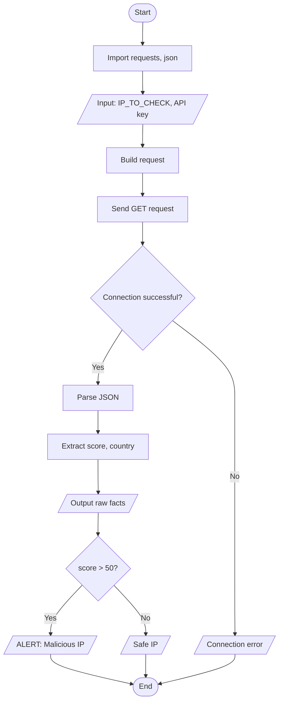

```mermaid
graph TD
    A([Start]) --> B[Import requests, json]
    B --> C[/Input: IP_TO_CHECK, API key/]
    C --> D[Build request]
    D --> E[Send GET request]
    
    E --> F{Connection successful?}
    F -- No --> G[/Connection error/]
    
    F -- Yes --> H[Parse JSON]
    H --> I[Extract score, country]
    I --> J[/Output raw facts/]
    
    J --> K{score > 50?}
    K -- Yes --> L[/ALERT: Malicious IP/]
    K -- No --> M[/Safe IP/]
    
    L --> N([End])
    M --> N
    G --> N
```