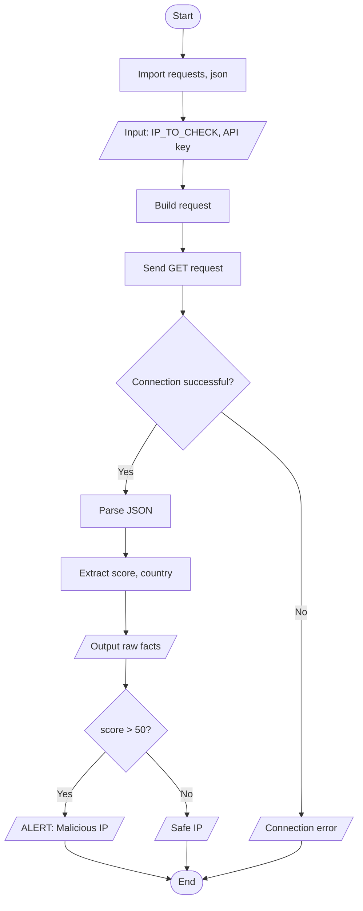

<p align="center">
  
  
  
</p>

# 🛡️ SecOps Threat Intel Dashboard

Online demo: 
<src="https://ultimate-secops-dashboard.streamlit.app/"/>

A tool for checking the reputation of IP addresses for cyber threats. The project includes an interactive web dashboard and automated risk assessment logic.

## 🌟 Key Features
* **IP Analysis:** Fetches data via an external API to retrieve the threat score and geolocation (country).
* **Web Interface:** A user-friendly dashboard built with the **Streamlit** framework.
* **Risk Assessment:** Automated detection of suspicious IPs (triggers an alert if the Threat Score > 50).
* **Notifications:** Supports Telegram integration for real-time threat alerting.

## 📂 Project Structure
```text
SECOPS_PROJECT1/
├── dashboard/
│   └── dashboard.py       # Main Streamlit web interface file
├── documentation/         # Documentation and flowcharts (Mermaid)
│   ├── Notification_tg/   # Telegram notification documentation
│   └── Thread_intel/      # IP verification logic flowcharts
├── threat_intel.py        # Core API logic and data analysis
└── readme.md              # Project description
```

## 🧠 Logic Flow



## 🚀 Installation and Setup

1. **Activate the virtual environment:**
   ```bash
   source myenv/bin/activate
   ```
2. **Install dependencies:**
   ```bash
   pip install requests streamlit
   ```
3. **Run the dashboard:**
   ```bash
   streamlit run dashboard/dashboard.py
   ```

## ⚙️ Usage
Enter the IP address you want to check and your API key in the dashboard's sidebar. Click the check button to get a detailed report and the threat level assessment.